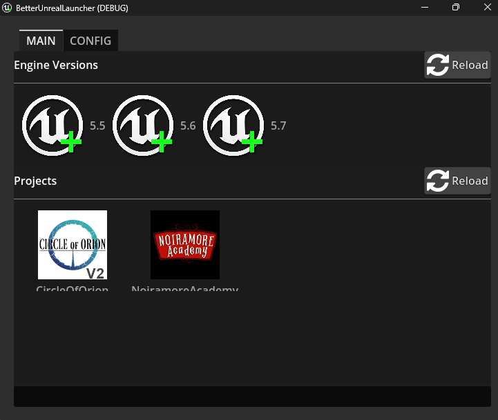
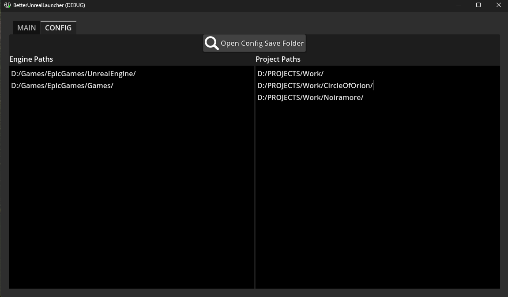

## A (Better) Unreal Engine Launcher

This is a very simple and fast alternative Unreal Engine project launcher written in Godot. (heh)

### How to use?
* Download & Launch it

* Go into `CONFIG` and add all paths to where your engine versions & projects are located (seperated by line breaks).`uprojects` are searched one folder deep from where the Project Path is.

* Back in `Main` select `Reload` to load your & project engine versions.
* Just double click your project and it will load. (WITHOUT closing the launcher.)